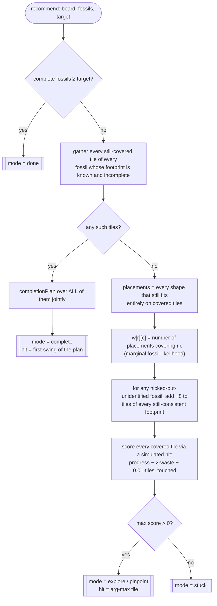
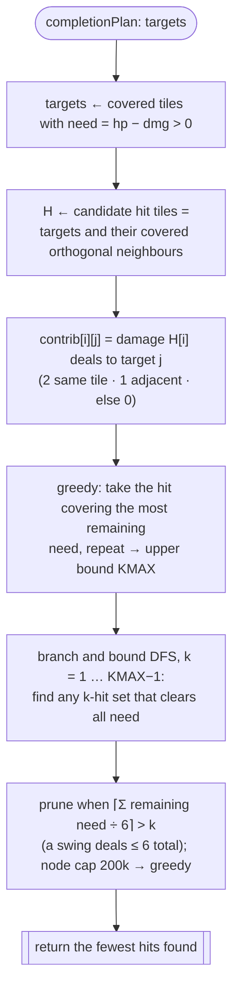

# Fossil-Solver Benchmarking & Heuristics

A reference for anyone measuring or improving the efficiency of the Fossil
Excavation solver. It documents what the benchmark optimises, how the harness
works, the production decision flow, the heuristics that win, and the knobs
available for further exploration.

All work happens in a few files:

| File | Role |
|------|------|
| `solver.js` | Pure engine. Damage model, placement enumeration, the completion planner, and `recommend()` (the production policy). No DOM, no network. |
| `bench.js`  | Dev-only Monte-Carlo harness. Plays full games against hidden fossils and reports hammers-to-clear. Node only. |
| `metrics.js` | Field metrics. Turns a live board snapshot into the same numbers (swings, empties, fossils) and compares a real game against the baselines below, live in the solver UI ("Field metrics vs benchmark"). |
| `gapfind.js` / `gapfind2.js` | Dev-only gap-finders — at every position they try every move and measure how much the best swap would save: vs the planted truth (`gapfind`) or, with luck removed, vs the resampled posterior (`gapfind2`). Used to confirm no exploitable slack remains. Node only. |

---

## 1. The objective

Uncover **all K fossils in the fewest hammer swings**. A swing is one hit on one
covered tile. The benchmark's primary metric is **mean swings per solved game**;
the secondary metric is **empty tiles broken** (collateral digging — a direct
proxy for wasted exploration).

### Game model being optimised

- **Damage:** a hit deals **+2** to the target tile and **+1** to each
  *orthogonally adjacent covered* tile. Damage accumulates; a tile breaks when
  `dmg >= hp`. The most a single swing can deal is **6** total (2 + four ×1).
- **Tiles** are `covered` (hittable), `empty` (broken, nothing under it), or
  `fossil` (broken, part of a fossil). Only covered tiles can be hit, and splash
  only lands on covered tiles.
- **Fossils** are rigid 4-tile shapes — `h4` (1×4), `v4` (4×1), `sq` (2×2). A
  fossil is uncovered only when **all four** of its tiles are broken. Fossils may
  touch; they are told apart on reveal.
- **Information model (critical):** breaking *any* tile of a fossil reveals its
  **full footprint** immediately. So once a fossil is nicked, its remaining tiles
  are known exactly and finishing it is a deterministic planning problem. This
  mirrors the live game (the server returns the whole shape on first contact),
  and the harness reproduces it (`tagReveal` sets `footprint` on first touch).

The game therefore splits cleanly into two sub-problems: **find** the hidden
fossils (search under uncertainty) and **finish** the known ones (exact planning).

---

## 2. The harness (`bench.js`)

```
node bench.js [N]        # N games per scenario (default 300)
ORACLE=1 node bench.js N # also print the positions-known lower bound
```

A single game (`simulate`): generate a board, place K fossils, then loop —
refresh which fossils are complete → ask the policy for a swing → apply it →
reveal whatever broke — until all K are uncovered or a 2000-swing safety cap is
hit.

- **Boards** (`genBoard`): every tile gets an HP drawn uniformly from the
  scenario's `hpChoices`. (An HP of `0` would mean a pre-empty tile; the shipped
  scenarios don't use it.)
- **Fossils** (`placeFossils`): K non-overlapping random placements on covered
  tiles. A seed that can't fit K is **skipped** (reported as `solved X/N-skipped`).
- **Determinism:** RNG is `mulberry32(1000 + gameIndex)`. Game *i* is identical
  across policies and across runs, so numbers are reproducible and policies are
  compared on the *same* boards. (Note: `buildSampleWeights`/`dedRec` draw from
  the global `Math.random()`, so sampling-based policies have run-to-run jitter of
  a few tenths of a swing — average over N≥150 to compare them.)

### Metrics per scenario

```
<label>  solved D/M  mean=..  median=..  max=..  emptiesBroken=..
```

- **solved D/M** — games fully cleared out of M attempted (M = N − skipped). Should be D = M.
- **mean / median / max** — swings over solved games. **mean is the headline.**
- **emptiesBroken** — average non-fossil tiles broken per solved game. Lower means
  less wasted digging; it usually moves with `mean`.

### Scenarios

| Label | Grid | HP pool | Fossils | Notes |
|-------|------|---------|---------|-------|
| `8x10 hp[3,4] K5`   | 8×10 | {3,4}   | 5 | Primary stress case (dense HP, the hardest to explore). |
| `8x10 hp[2,3,4] K5` | 8×10 | {2,3,4} | 5 | Softer tiles break sooner, so exploration is cheaper. |
| `6x6 hp[1,2,3] K3`  | 6×6  | {1,2,3} | 3 | Small board, mostly a sanity check. |

### Baselines

- **Oracle** (`runOracle` / `ORACLE=1`): fossil positions are known from the
  start, so the policy goes straight to completion with zero search. This is the
  **lower bound** — the cost of *finishing* with no *finding*. The gap between a
  real policy and the oracle is the price of uncertainty.
- **Naive** (`naiveRecommend`): clear tiles in reading order, early-stop at K.
  The "do nothing clever" reference.

---

## 3. Production decision flow (`recommend`)

`recommend(board, fossils, target)` returns `{ mode, hit:[r,c]|null, reason }`.
`fossils` is the revealed-so-far list; each has `cells`, a `footprint`
(`{shape,cells}` or `null`), and a `complete` flag.



The key structural decision: **completion is a hard gate, not a weighting.** If
*any* known-footprint fossil has covered tiles left, the solver finishes (some
of) them and never explores that turn. With a footprint known, there is no
information left to gain — only tiles to clear — so exploring would be strictly
wasteful. Exploration runs only when nothing is left to finish.

### 3a. Completion planner (`completionPlan`)

Given a set of target tiles, find a near-minimum multiset of swings that breaks
them all. Used both to finish known fossils and as a primitive by several
experimental policies.



Solving all known fossils **jointly** (one target list) rather than one fossil at
a time lets a single swing's +1 splash chip tiles of two adjacent fossils at
once — strictly ≤ the per-fossil cost.

---

## 4. The winning heuristics

### Completion: joint minimum-swing planning, with a probe-aware finishing blow
Greedy upper bound, then branch-and-bound for the true minimum, with the
`⌈need/6⌉` admissible lower bound for pruning. Completion isn't where the *bulk* of
swings are lost — but it isn't free of slack either. Among the hits that finish the
known fossils in the **same** minimal number of swings, `bestCompletionHit` picks
the one whose +1 splash also breaks the highest-likelihood covered tile — a *free*
probe for the next fossil. (Landing the finishing blow from a promising neighbour
reveals a tile and avoids the overkill of hitting a 1-HP fossil cell directly.)
Swing-neutral by construction — it rejects any candidate that would add a completion
swing — yet worth **≈0.9 swings (~2.5–3%)** on every board (8×10 HP[3,4]: 36.7 →
35.8). The telltale "more empties broken, *fewer* swings" confirms the probe is
genuinely free: the finishing swing was already spent.

### Exploration: marginal-likelihood probing, no break-rush
1. **Where could a fossil still be?** Enumerate every shape placement that fits
   entirely on covered tiles (`candidatePlacements`). `w[r][c]` = how many of
   those cover tile `(r,c)`. High `w` = high marginal probability of fossil.
2. **Lean toward fossils already nicked** but not yet shape-identified: +8 on the
   tiles of every footprint still consistent with the revealed cells.
3. **Score each covered tile** by simulating its hit and summing over touched
   tiles:

   ```
   progress = Σ  w[t] · min(dealt, need) / need      // weighted chip toward likely fossils
   waste    = Σ  max(0, newDmg − hp)   over breaks    // overkill past the break point
   score    = progress − 2·waste + 0.01·tiles_touched
   ```

   Pick the maximum. A non-positive max means no covered region can still hold a
   fossil → `stuck`.

The decisive property is what the score **omits**: it gives **no reward for
breaking a tile this swing.** Rewarding immediate breaks makes the probe pop
whatever low-HP junk tile it can reach right now, spending swings cracking empties
early. Scoring purely by *likelihood-weighted progress minus overkill* steers
chip damage onto the tiles most likely to be fossils instead. See §6.

---

## 5. Tuning knobs (`makeRec`)

`makeRec(opts)` builds a sweepable replica of the explorer so scoring terms can be
varied without touching `solver.js`. (The production `recommend` is equivalent to
`makeRec({ wImm: 0, wProg: 1, wWaste: 2 })` plus the *joint* completion gate;
`makeRec` uses a simpler per-fossil completion gate, which is why it is a replica,
not the shipped function. Both are wired into the `variants` array.)

| Option | Default | Effect |
|--------|---------|--------|
| `wImm` | 1000 | Reward for placement-weight of tiles that **break** this swing (the "break-rush"). |
| `wProg` | 10 | Reward for likelihood-weighted **chip** progress. |
| `wWaste` | 0.5 | Penalty per point of **overkill** past a tile's break point. |
| `wAdj` | 0 | Reward for hitting near already-damaged tiles (**concentration**). |
| `weightMode` | `'count'` | `'count'` = independent placement density; `'sample'` = marginal from `nSamples` valid **joint** layouts of the hidden fossils. |
| `nSamples` | 250 | Layouts drawn when `weightMode='sample'`. |
| `breakBonus` | 0 | Flat per-break bonus (cruder break-rush). |
| `compAsWeight` | false | If true, fold completion into the weight map (+100 on known-fossil tiles) instead of using a hard completion gate — i.e. **interleave** finding and finishing. |

To explore: edit the `variants` array near the bottom of `bench.js` and run.
A variant is just `['label', policyFn]`.

### Writing a new policy
Any function with this contract drops straight into `variants`:

```js
function myPolicy(b, fossils, target) {
  // b: { rows, cols, cells[r][c]:{state,hp,dmg,fossil} }
  // fossils: revealed-so-far; each {cells, footprint|null, complete}
  // return { mode, hit: [r, c] | null }   // null hit ends the game (done/stuck)
}
```

Useful engine primitives (all on the `FS` export): `isCovered`, `simulateHit`,
`orthoNeighbors`, `candidatePlacements`, `cellWeights`, `fossilFootprints`,
`completionPlan`, `SHAPES`.

---

## 6. Reference results

`node bench.js 200` (HP[3,4] board headline; deterministic boards):

| Policy (8×10 HP[3,4] K5) | mean swings | empties broken |
|--------------------------|:-----------:|:--------------:|
| **Production `recommend`** | **35.8** | 22.3 |
| ↳ without the completion-probe tie-break | 36.7 | 21.7 |
| Reward immediate breaks (`wImm=1000`) | 41.3 | 25.8 |
| Add concentration bonus (`wAdj=5`) | 40.2 | 28.5 |
| Interleave find+finish (`compAsWeight`) | 47.5 | 32.2 |
| Sample-posterior weights (`weightMode='sample'`) | ≈36.9 | 22.2 |
| Forced-cell deduction (sampled certainty) | 36.7 | 21.8 |
| Commit-to-densest placement | 38.2 | 21.2 |
| **Oracle** (positions known) | **21.5** | — |

All three scenarios, production policy vs oracle:

| Scenario | production mean | oracle mean |
|----------|:---------------:|:-----------:|
| `8x10 hp[3,4] K5`   | 35.8 | 21.5 |
| `8x10 hp[2,3,4] K5` | 29.4 | 19.2 |
| `6x6 hp[1,2,3] K3`  | 10.2 | 8.0 |

### How to read the gap
The production policy and the oracle differ only in **knowledge of fossil
positions**, so the gap (≈14 swings on the dense board) is the cost of *search*,
not of *planning*. Two observations bound how much of that gap is recoverable:

- A strictly better probability model (sample-posterior, drawing valid joint
  layouts) does **not** beat cheap count weights. Inference quality is not the
  bottleneck.
- Targeting **forced** tiles (a fossil in every legal layout) ties the plain
  probe, because a forced tile already carries the maximum marginal weight — the
  probe was going to pick it anyway.

The remaining gap is therefore close to the **information-theoretic floor**:
distinguishing the true layout from all legal layouts of K rigid tetromino-sized
shapes requires on the order of `log2(#legal layouts)` informative probes, and
the probe already spends about that many. The lever for further gains is not a
smarter scoring heuristic; it would have to be a different *information* model
(e.g. exploiting structure the current placement enumeration ignores).

### Confirming no slack is left (`gapfind`)
To be sure the heuristic isn't leaving easy swings on the table, `gapfind.js` plays
many simulated games and, at every position, tries **every** covered tile as the next
move, plays the rest out, and measures how much the best single swap would have saved
— a 1-ply regret. Against the *planted* truth that regret is dominated by luck
(swapping onto a tile that happened to hide a fossil — irreducible). `gapfind2.js`
removes the luck by averaging each candidate over many **resampled** layouts
consistent with what's revealed (the solver's posterior). There the residual regret
collapses as samples rise (summed regret 45 → 13 going from 12 to 40 samples per
candidate) — the signature of the *optimizer's curse* (the minimum of noisy estimates
is biased low), not a real gap. Conclusion: after the completion-probe tie-break,
**no systematic, config-robust improvement remains** — what's left is the information
floor above.
