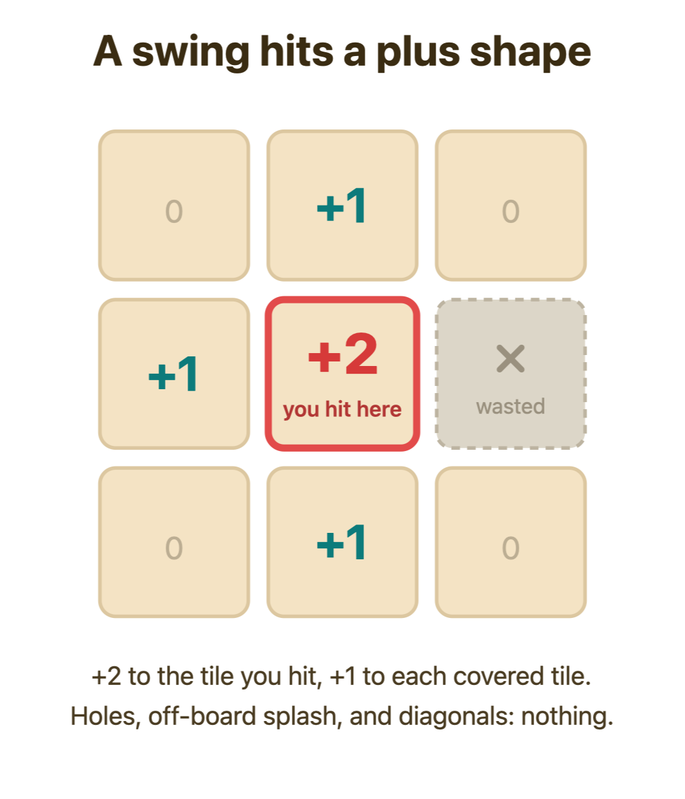
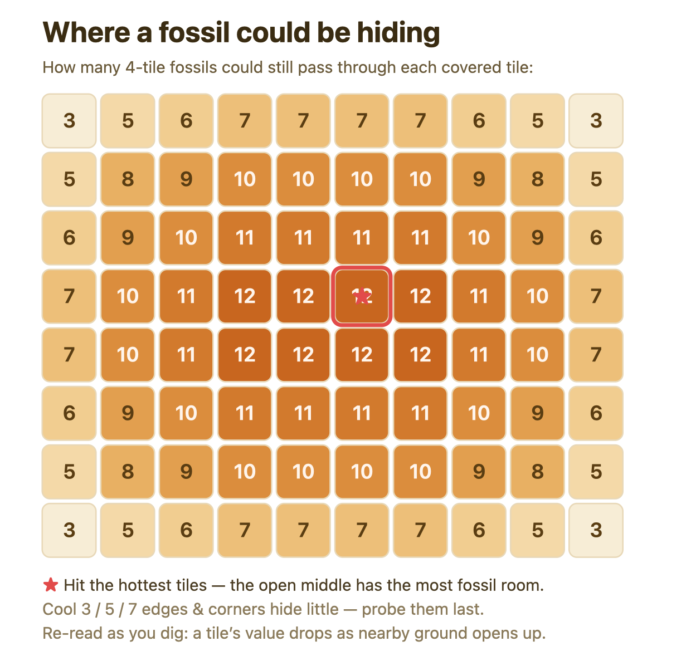
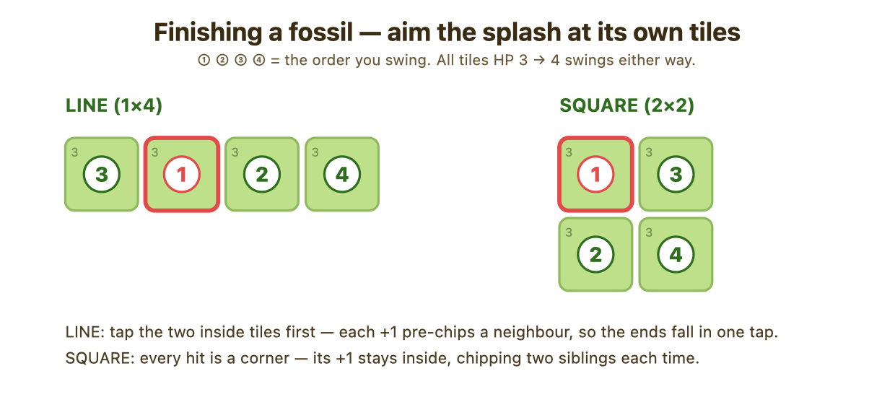
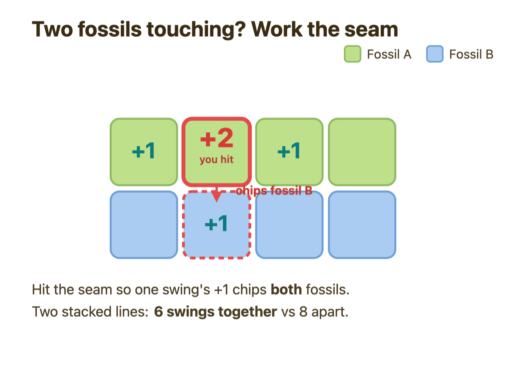

# Solving Fossil Excavation by hand

*A field guide for EF2 players who can't run the solver. You don't need to count anything a computer would — you just need to know what to look at.*

---

## 1. The big idea

Fossil Excavation is really two games stitched together: **finding** fossils and **finishing** them. Every fossil is buried completely hidden — until you chip a single one of its tiles, at which moment the game hands you its **entire shape and position for free**. So a fossil is never "half-known": it's either a total mystery or fully solved. That splits your whole job into a clean loop: probe blind ground until you nick something, immediately switch to clearing that now-fully-revealed fossil in as few swings as possible, then go back to probing. Play that loop well and you'll dig near-optimally without a single calculation.

---

## 2. How a swing works

You aim **one swing at one covered tile**. It deals:

- **+2** to the tile you hit, and
- **+1** to each tile directly **up / down / left / right** of it (never diagonal).

<p align="center"></p>

**Key rules to keep in your head:**

- **Splash only lands on covered tiles.** Any arm of the plus that points off the board, into a hole, or onto an already-found fossil simply does nothing. It does *not* redirect or spill over.
- **Damage adds up and is permanent.** A tile **breaks the instant its total damage reaches its HP** (exactly equal counts — an HP-2 tile dies to a single +2; an HP-1 tile dies to a single +1 splash).
- **Aim where the plus is fully surrounded.** A swing deep in covered ground does the most total work; one out at the rim or next to your old holes wastes part of its splash.

| Where you aim | Covered neighbours | Max damage that swing |
|---|---|---|
| Deep interior | 4 | **6** (the hard ceiling) |
| Against an edge | 3 | 5 |
| In a corner | 2 | 4 |

**The three fossil shapes** — every fossil is exactly four tiles in one of these (no other rotations):

```
h4  (1x4 horizontal)     v4  (4x1 vertical)      sq  (2x2 block)
  X X X X                  X                        X X
                           X                        X X
                           X
                           X
```

A fossil is only **won when all four of its tiles are broken**. Fossils can sit flush against each other; on reveal they're told apart by colour.

---

## 3. FINDING fossils (the search)

You're probing blind ground, trying to nick *any* tile of *any* hidden fossil. Some covered tiles are far likelier to hide a fossil than others — and you can see this by eye.

### The eyeball-likelihood: "how much fossil room is here?"

A tile's value ≈ **how many ways a straight 4-in-a-row (across or down) or a 2×2 block of still-covered tiles can be drawn through it.** In plain terms: *how deeply buried it is in open covered ground, measured in straight lines and blocks.* Here's the value of every tile on a fresh 8×10 board — notice it peaks dead-center and falls off toward the rim:

<p align="center"></p>

### The search rule

1. **Cross off the dead zones.** Any covered patch too cramped to hold *any* 4-tile fossil (no run of 4 in a line, no 2×2) can't hide anything — skip it entirely.
2. **Aim at the biggest covered blob**, and within it look at the **interior** — tiles whose four neighbours are all covered.
3. **Prefer two open axes over one.** The best tile has covered ground reaching out several steps in *both* a horizontal and a vertical direction (so an h4, a v4, *and* a 2×2 could all pass through it). A tile deep in a 1-wide corridor is poor — only one orientation fits.
4. **Mind the splash.** Among near-equal tiles, pick the one whose four neighbours are also high-value covered interior. Splash that lands on more likely tiles is free progress; splash pointing into a hole is wasted.
5. **Break ties toward the lower-HP tile.** Among covered tiles of roughly equal coverage, prefer the one with the **lowest remaining HP**. A single +2 finishes a 2-HP tile but only half-fills a 4-HP one, and the solver's own scoring rewards that — it credits progress as a fraction of what each tile still needs. The coverage rule gets you to the right *region*; this tie-break is how the solver picks the exact tile inside it.

> **Rule of thumb:** *Hit the covered tile that's deepest inside the largest covered area — the one with the longest unbroken runs of covered tiles in all four directions, whose neighbours are all covered interior — and, among equals, the one with the lowest HP.*

> **Honesty box — don't expect tile-for-tile agreement.** This coverage rule reliably finds the right *region*, but it will often disagree with the solver on the exact tile to hit. The solver also factors HP (it leans toward low-HP tiles) and the precise splash-onto-fossil credit, neither of which you can compute by eye. In simulation a faithful coverage-follower picks a different tile from the solver on the majority of search moves — mostly harmless ties, but a real share are the solver deliberately choosing a lower-HP tile. **The region is what matters most; don't sweat exact-tile matches.**

### Don't rush to break a tile

This is the counterintuitive part. **There is no reward for breaking a tile sooner.** Two traps to avoid:

- **Don't detour to pop an easy low-HP junk tile.** A reachable 1-HP tile you could break right now earns you nothing toward finding a fossil. Keep chipping toward the high-value ground instead.
- **Don't blow a direct +2 on a tile that only needs 1.** That overkills. Save your +2 for fresh high-value ground; let a *neighbour's* +1 splash mop up the nearly-dead tile.

(Note this is about *detours and overkill*, not HP for its own sake. When two candidate tiles cover equally well, the lower-HP one is the better target, per rule 5 above — what you avoid is going *out of your way* to pop something, or wasting a full +2 where a +1 would do.)

---

## 4. FINISHING a fossil (the arithmetic)

The moment you nick a fossil, its whole shape appears. Now there's nothing to learn — only tiles to break, in the fewest swings.

### The hard gate

**If any revealed fossil still has covered tiles, you finish — full stop. Never go prospecting with a known fossil unfinished.** Finishing first is always correct.

### The whole trick: aim so the splash lands on the fossil's own tiles

- **Lines (h4 / v4): hit an *interior* tile, not an end.** Its +1 reaches a sibling on each side. An end tile only splashes one sibling. *(This is the aiming rule for the common HP-3 case. At very low or very high HP the cheapest plan can favour repeating an end — see the note below.)*
- **Square (sq): hit a *corner of the block*.** Its +1 reaches the two adjacent siblings inside the square — which is why the 2×2 finishes faster than a line at HP2 and HP4 (the two tie at HP3).
- **March the +2 along the shape so each tile soaks a +1 from a neighbouring swing before you tap it.** At HP ≤ 3 that means most tiles need just one direct tap. **At HP4 a line tile needs two direct +2 hits** (a single +1 soak plus one +2 is only 3 of the 4 it needs), so you'll double-tap two interior tiles — the 2×2 still finishes in 4 because its corner splashes do more sibling work. The swing-count table below is the source of truth; let it, not the aiming slogan, set your expectations.

<p align="center"></p>

**Swing counts to memorize** (per 4-tile fossil):

| HP | Line (h4/v4) | Square (2×2) |
|---|---|---|
| 2 | 3 swings | **2 swings** |
| 3 | 4 swings | 4 swings |
| 4 | 5 swings | **4 swings** |

The square wins at HP2 and HP4 because its corners splash two siblings at once; HP3 is the flat case where all three shapes cost 4.

### Worked mini-examples (all at HP 3, open board)

**h4** — tiles `(3,3)(3,4)(3,5)(3,6)`:

| Swing | Hit | Result |
|---|---|---|
| 1 | (3,4) | (3,4)→2 · (3,3)→1 · (3,5)→1 |
| 2 | (3,5) | (3,5)→**break** · (3,4)→**break** · (3,6)→1 |
| 3 | (3,3) | (3,3)→**break** |
| 4 | (3,6) | (3,6)→**break** |

The two interior hits pre-load every tile with +1, so at HP3 the two ends need just one tap each.

**v4** — tiles `(2,4)(3,4)(4,4)(5,4)`: identical pattern rotated. Hit the two interior tiles `(3,4)` then `(4,4)`, then mop the ends `(2,4)` and `(5,4)`. 4 swings.

**sq** — tiles `(3,4)(3,5)(4,4)(4,5)`:

| Swing | Hit | Result |
|---|---|---|
| 1 | (3,4) | (3,4)→2 · (4,4)→1 · (3,5)→1 |
| 2 | (4,4) | (4,4)→**break** · (3,4)→**break** · (4,5)→1 |
| 3 | (3,5) | (3,5)→**break** · (4,5)→2 |
| 4 | (4,5) | (4,5)→**break** |

Every hit is a corner, so each splash stays inside the square and chips two siblings.

### Joint finishing — work the seam

If **two revealed fossils touch**, don't clear one then the other. Aim hits **on their shared border** so one swing's +1 splash chips a tile of *each* fossil. Expect to save roughly one swing per shared edge. (Two stacked h4s at HP3 cost **6 swings jointly** vs **8** done separately.)

<p align="center"></p>

### The finish-from-a-neighbour trick (a free probe)

When a fossil tile needs only **1 more** damage, you often have two equal-cost options:

- tap the tile directly (+2 → overkills by 1), **or**
- finish it with the **+1 splash from a hit on a neighbouring covered tile**, spending your +2 on fresh ground.

**Prefer the neighbour hit when one exists and it finishes in the same number of swings** — and choose the neighbour whose own +2 lands on the **most promising open covered ground nearby** (a likely home for the *next* hidden fossil). Same swing count, but you finish the current fossil *and* scout your next one for free.

Two honest caveats: the substitution only applies when it keeps the swing count identical — never add a swing for it. And it isn't unconditional: if the direct hit's own splash lands on better covered ground than any neighbour's would, the solver keeps the direct hit; and when a needy tile has no covered neighbour at all, the only legal finishing hit *is* the direct tap.

---

## 5. A full worked game

A real 6×6 board, HP ∈ {1,2,3}, 3 fossils. Letters below mark the hidden fossils so *you* can follow — **the player sees none of these; every tile just looks "covered."**

```
     C1  C2  C3  C4  C5  C6
R1    2   3   2   1   3   2
R2    3   3C  3   3   1   1
R3    3   3C  3   1A  2   2
R4    3   1C  2   1A  2   3
R5    2   1C  3   3A  2B  3B
R6    1   2   1   1A  2B  1B
```

- **A** = vertical v4 down column 4 (R3–R6)
- **B** = 2×2 square at bottom-right (R5–R6, C5–C6)
- **C** = vertical v4 down column 2 (R2–R5)

A and B are **edge-adjacent** (R6C4 sits next to R6C5 in the same row). In this game that adjacency doesn't actually save a swing — A is finished long before B is even revealed — so treat it as a map feature, not a shortcut.

**Swing 1 — FIND.** The densest covered ground is dead-center. Hit **R4C3** — *one of the four top-value center tiles* (R3C3, R3C4, R4C3, R4C4 all tie on coverage). Pure coverage can't single one out; the solver lands on R4C3 because it's an HP-2 tile (a +2 finishes it) whose +1 splash falls on two soft fossil cells. A coverage-only player would happily hit any of the four center tiles, and that's fine — same region. R4C3 is a **plain covered tile (no fossil under it)**, but its splash arms reach left and right into **R4C2** and **R4C4**, nicking *two different vertical fossils at once.* Both footprints reveal instantly. Two v4s now fully known.

**Swings 2–6 — FINISH (jointly).** Six fossil tiles remain across the two columns; the minimum is 5 swings, planned *together* so shared splash geometry helps both.

- **Swing 2 — hit R3C5.** Here's the neighbour-finish trick live: instead of hammering a fossil tile directly, the swing lands its +1 on fossil tile **R3C4** to finish it, *while* clearing two empty tiles as a free look — same 5-swing finish, better information.
- **Swing 3 — hit R5C3**, splashing R5C2 (fossil C) and toward column 4 at once.
- **Swing 4 — hit R2C2** (chips the top of column C, no break yet — it had 3 HP).
- **Swing 5 — hit R3C2** → breaks R3C2 and R2C2. **Fossil C fully uncovered.**
- **Swing 6 — hit R5C4** → breaks R5C4 and R6C4. **Fossil A fully uncovered.** (Bonus: this swing's splash also dropped a free +1 on R5C5 — a tile of the *still-hidden* square — softening it for later.)

Two of three fossils done in six swings.

**Swings 7–9 — FIND again.** Now we hunt the third fossil. Two of these are honest misses into empty ground (**R1C3** and **R3C1**) — the unavoidable price of searching blind. The middle one, **R4C6**, is *not* a miss: it's a covered HP-3 non-fossil tile, and its +1 splash nicks **R5C6** (a tile of fossil B), pre-loading it from 0/3 to 1/3. That soak is exactly what lets swing 10 finish R5C6 with a single +2 later. The swings steer toward the densest remaining covered regions, not toward whatever's easiest to pop.

**Swing 10 — FIND, the payoff.** Hit **R5C6**. The direct +2 finishes R5C6 (already at 1/3 from swing 8's splash), and its two +1 arms finish **R5C5** (softened to 1/2 back on swing 6) and **R6C6** (HP 1) — so this single swing breaks **three of the square's four tiles**. Footprint reveals.

**Swing 11 — FINISH.** Hit **R6C5**, the last covered tile of the square. **Done in 11 swings.**

---

## 6. How well this does, and honest limits

A careful player following these rules by eye plays *near* the solver, but how near isn't a number we can hand you: **there is no by-eye policy in the benchmark harness, so the exact swing cost of the hand method is unmeasured.** What *is* measured is the production solver — **35.8 swings per game** on the benchmark 8×10 HP[3,4] board — and a perfect oracle at **21.5**. The hand method aims to approach the solver's search heuristic; it won't match it tile-for-tile (see §3's honesty box), mainly because the solver also weighs HP and exact splash credit you can't compute by eye.

**Where the real gap comes from — and why you shouldn't overthink it:**

- The floor isn't zero. An oracle that *already knew where every fossil was* would need about **21.5 swings**. The roughly **14-swing gap** between that and any blind player is **the irreducible cost of searching unknown ground** — it cannot be removed by being cleverer.
- **Fancier deduction does not help.** Because a single nick reveals a fossil's *entire* shape, there's never a partial-information puzzle to reason about — so there's nothing for elaborate logic to chew on. Don't try to "deduce" where fossils are from your misses; just keep probing the densest covered ground.
- **Avoid the known traps**, which cost more than imperfect aim ever will: break-rushing (chasing easy pops) runs ~41 swings, and interleaving find-and-finish (prospecting while a known fossil sits unfinished) blows up to ~47.

**The entire method in one line:** *Finish any known fossil first (interior hits for lines, corners for squares, work the seams, mop the 1-need tiles with a neighbour's splash). Otherwise probe the deepest, most-open covered ground — preferring the lower-HP tile among equals — and never rush a break.*
